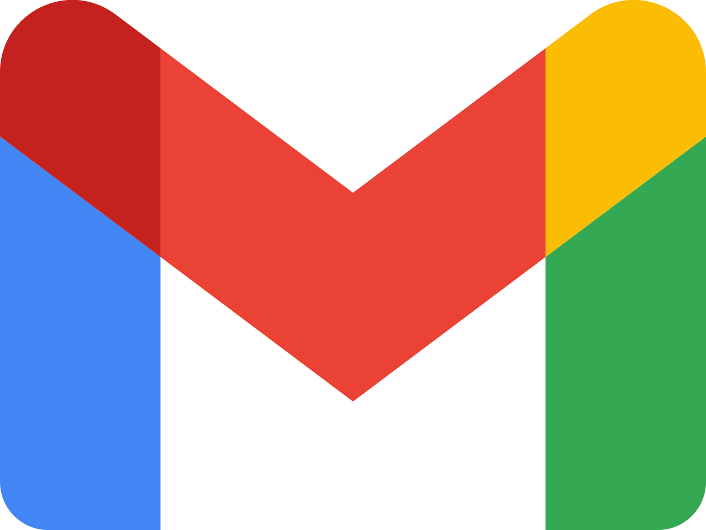

  

<h1 align="center"> 
  Hello there, I'm Emiliano, 
</h1>
<h2>🧑‍💻 About me.</h2>

I'm a **freelance full-stack developer** and **electronics engineer**, focused in embedded systems and web apps.
I developed many tools for increase my work productivity and currently, I'm looking for a job that allows me improve my programming skills and become part of a work team

find all my projects <a href="https://portafolio-ed.vercel.app" target:"_blank">here</a>

My most recently project is an **IoT** platform, I developed completely alone.
- it has a **NodeJS** server for user and device register on a **MongoDB** database, currently I'm migrating it to an **SQL** database.
- also has a **ReactJS** front-end for allow user control and manage devices
- I developed too different firmwares for IoT devices using **ESP32** and **ESP8266** MCU's and **MQTT protocol** for ligth control, temperature control and door opening.
- Mini demo -> <https://smarthomefe-git-demo-emiliano-dovichis-projects.vercel.app/>.

## 📫 How to reach me?

  
  

  
## \<\\\> Languages & tools.
<!-- 

  
 -->

- 🖥️&nbsp;&nbsp;   Python &nbsp;&nbsp;   JavaScript  &nbsp;&nbsp;   C# &nbsp;&nbsp;  C++  &nbsp;&nbsp;  C
- ⚙️&nbsp;&nbsp;Git &nbsp;&nbsp; GitHub &nbsp;&nbsp;  Visual Studio Code

<!-- 

 -->
<!--
special_ ✨ repository because its `README.md` (this file) appears on your GitHub profile.

Here are some ideas to get you started:

- 🔭 I’m currently working on ...
- 🌱 I’m currently learning ...
- 👯 I’m looking to collaborate on ...
- 🤔 I’m looking for help with ...
- 💬 Ask me about ...
- 📫 How to reach me: ...
- 😄 Pronouns: ...
- ⚡ Fun fact: ...
-->
